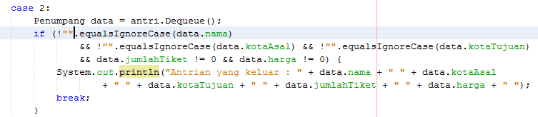
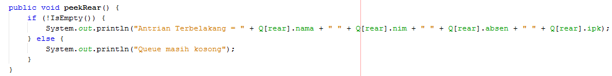
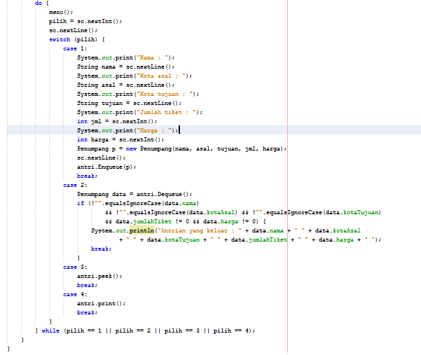
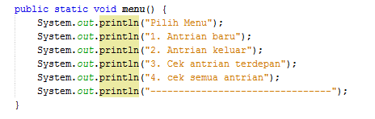

# Jawaban Jobsheet 3
## 8.2.3 Pertanyaan
Jawaban
1. Pada method Create, mengapa atribut front dan rear diinisialisasi dengan nilai -1, tidak 0? 
## jawab
Karena setiap array di mulai dari indexs ke 0, dan di method create rear dan front di inisialisasikan -1 di maksutkan untuk menunjukkan bahwa sizenya masih dalam konsisi kosong/0, sementara jika di inisialisasikan dengan bilangan 0 maka akan berbeda maksut, yakni size nya tidak lagi kosong (bernilai 1).

2.	Pada method Enqueue, jelaskan maksud dan kegunaan dari potongan kode berikut!
## jawab
Maksud adalah jika rear/data berada pada posisi max-1/indexs terakhir dari array, maka jika ingin menambahkan data baru, maka akan di tempatkan pada index ke -0.

3. Perhatikan kembali method Enqueue, baris kode program manakah yang menunjukkan bahwa data baru disimpan pada posisi terakhir di dalam queue? 
## jawab
Q[rear] = data;

4. Perhatikan kembali method Dequeue, baris kode program manakah yang menunjukkan bahwa data yang dikeluarkan adalah data pada posisi paling depan di dalam queue?
## jawab
data = Q[front];

5. Pada method Dequeue, jelaskan maksud dan kegunaan dari potongan kode berikut! 
## jawab
Maksud nya adalah apabila front berada pada posisi max-1 atau indexs terakhir dari array, maka jika ingin menambahkan data baru, maka akan di tempatkan pada index ke -0.

6.	Pada method print, mengapa pada proses perulangan variabel i tidak dimulai dari 0 (int i=0), melainkan int i=front? 
## jawab
Karena posisi front atau data terdepan tidak selalu pada indeks ke-0, sedangkan perulangan dimulai dengan posisi frontnya.

7.	Perhatikan kembali method print, jelaskan maksud dari potongan kode berikut 
## jawab
maksudnya adalah, nilai i(front) jika tidak berposisi sebagai rear, maka akan dilakukan penambahan pada variable tersebut lalu akan dimodulus dengan nilai max atau kapasitas dari Queue tersebut. Gunanya untuk mencegah melakukan print melebihi max, sehingga di lakukan modulo max 

## 8.3.3 Pertanyaan

1.	Perhatikan class Queue, apa fungsi kode program berikut pada method Dequeue? 
## jawab
kode program tersebut digunakan untuk deklarasi objek dengan menggunakan konstruktor berparameter.

2.	Pada soal nomor 1, apabila kode program tersebut diganti dengan kode berikut: Penumpang data = new Penumpang() Apakah yang terjadi? Mengapa demikian? 
## jawab
Program akan eror dan tidak dapat di run, karena konstruktor yang digunakan adalah konstruktor berparameter, sehingga perlu diisikan nilai di dalam tanda kurung tersebut.

3.	Tunjukkan kode program yang digunakan untuk menampilkan data yang dikeluarkan dari queue! 
## jawab

4.	Lakukan modifikasi program dengan menambahkan method baru bernama peekRear pada class Queue yang digunakan untuk mengecek antrian yang berada di posisi belakang! Tambahkan pula daftar menu 5. Cek Antrian paling belakang pada class QueueMain sehingga method peekRear dapat dipanggil!
## jawab

